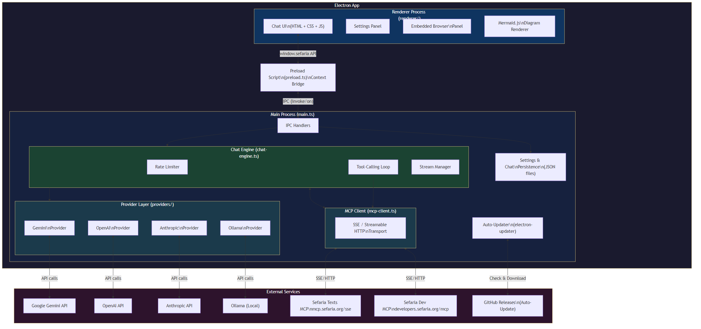
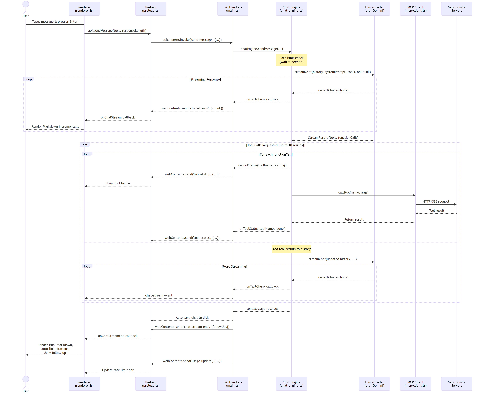

# Sefaria Desktop

A cross-platform desktop app for exploring the [Sefaria](https://www.sefaria.org/) library of Jewish texts, powered by AI and [Sefaria's MCP servers](https://developers.sefaria.org/docs/the-sefaria-mcp).

> **Disclaimer:** This application is not developed by, affiliated with, or endorsed by [Sefaria.org](https://www.sefaria.org/). It is an independent project that uses Sefaria's publicly available MCP (Model Context Protocol) servers.
>
> &copy; 2026 Jason Leznek. Released under the MIT License.

## Features

- **Multiple AI providers** — Use cloud models or run entirely offline with local models:

  | Provider | Models | API Key | Notes |
  |----------|--------|---------|-------|
  | [Google Gemini](https://aistudio.google.com/apikey) | Gemini 2.5 Flash, 2.5 Pro, etc. | Free tier available | Full tool-calling support |
  | [OpenAI](https://platform.openai.com/api-keys) | GPT-4o, GPT-4o mini, o3-mini, etc. | Paid | Full tool-calling support |
  | [Anthropic](https://console.anthropic.com/) | Claude Sonnet 4, Claude Haiku, etc. | Paid | Full tool-calling support |
  | [xAI (Grok)](https://console.x.ai/) | Grok 3, Grok 3 Mini, etc. | Paid | Full tool-calling support |
  | [Mistral AI](https://console.mistral.ai/) | Mistral Small, Medium, Large | Paid | Full tool-calling support |
  | [DeepSeek](https://platform.deepseek.com/) | DeepSeek-V3, DeepSeek-R1 | Paid | Full tool-calling support |
  | [Ollama](https://ollama.com/) (local) | Llama, Mistral, Qwen, any model you pull | None — runs locally | No API key or internet needed for the AI; citations are auto-linked |

- **Chat interface** — Ask questions about Jewish texts in natural language
- **Text lookup** — Look up specific references (e.g., "Genesis 1:1", "Talmud Berakhot 2a")
- **Library search** — Search across the entire Sefaria library
- **In-app text viewer** — Click any citation to read the source text in a side pane
- **API help** — Get guidance for building with the Sefaria API
- **Streaming responses** with live Markdown rendering
- **Tool calling** — The AI automatically calls Sefaria MCP tools to retrieve accurate text and citations
- **Print preview** — Generate a PDF preview of your conversation from within the app
- **Citation auto-linking** — Sefaria text references are automatically hyperlinked, even with local models

## Architecture



The app follows Electron's multi-process architecture with a clean separation between the main process (Node.js) and the renderer process (Chromium). See [docs/](docs/) for detailed diagrams and the full technical reference document.

### How It Works

1. **User sends a message** → the renderer calls `window.sefaria.sendMessage()` through the context bridge
2. **Chat Engine** checks rate limits, then streams the request to the configured LLM provider
3. **LLM responds** with text (streamed live to the UI) and optionally requests tool calls
4. **Tool-calling loop** — the engine executes MCP tools against Sefaria's servers, feeds results back to the LLM, and repeats (up to 10 rounds)
5. **Final response** is rendered as Markdown with auto-linked Sefaria citations, Mermaid diagrams, and LaTeX math



## MCP Servers

The app connects to two Sefaria MCP (Model Context Protocol) servers:

| Server | URL | Purpose |
|--------|-----|---------|
| Sefaria Texts MCP | `https://mcp.sefaria.org/sse` | Query the Sefaria library of Jewish texts |
| Sefaria Developers MCP | `https://developers.sefaria.org/mcp` | Query the Sefaria API for code/dev assistance |

## Getting Started

1. Install & run:

```bash
npm install
npm start
```

2. Choose your AI provider from the dropdown and enter an API key (if required).
   - **Gemini** is a great free option — get a key from [Google AI Studio](https://aistudio.google.com/apikey)
   - **Ollama** requires no API key — just install [Ollama](https://ollama.com/), pull a model, and select it in the app
3. Your key is stored locally and never shared.

## Requirements

- Node.js 20+
- For cloud providers: an API key (Gemini offers a free tier)
- For offline/local use: [Ollama](https://ollama.com/) installed with at least one model pulled

## Building Distributable Packages

```bash
# Windows installer + portable
npm run dist:win

# macOS .dmg
npm run dist:mac

# Linux AppImage + .deb
npm run dist:linux
```

Output goes to the `release/` directory.

## Development

```bash
npm install

# Build once + launch
npm start

# Watch mode (auto-rebuild on changes)
npm run watch
# Then in another terminal:
npx electron .

# Debug in VS Code: press F5 (uses launch.json)
```
